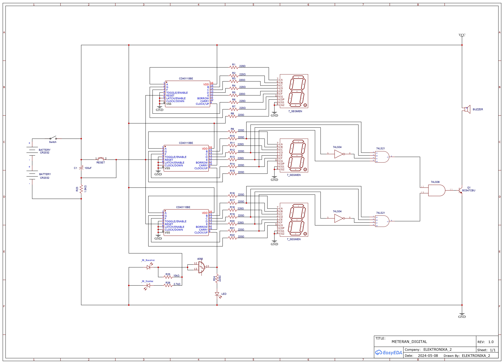
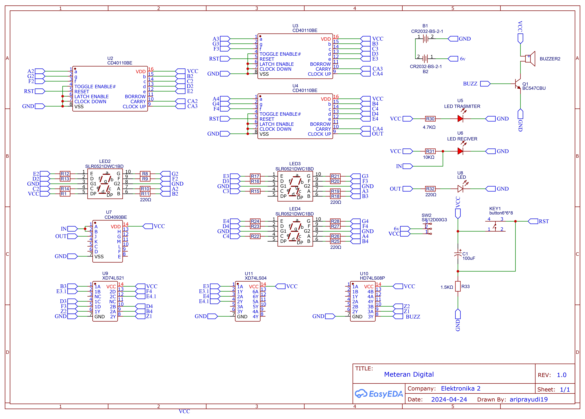

# 📐 Digital Meter Counter

Proyek ini merupakan **meteran digital** berbasis rangkaian elektronika menggunakan **sensor infrared, IC counter, dan seven segment display**.  
Alat ini dapat menghitung jarak berdasarkan putaran roda berlubang dan menampilkan hasilnya dalam satuan **cm** melalui seven segment.

---

## ⚡ Fitur Utama
- Menampilkan jarak yang terukur pada **tiga seven segment**.
- Menggunakan **sensor infrared** untuk mendeteksi lubang pada roda berdiameter 3,18 cm (10 lubang).
- **1 lubang = 1 cm**, sehingga **1 putaran penuh = 10 cm**.
- Seven segment akan mulai dari **0** saat saklar switch dinyalakan.
- Jika jarak sudah mencapai **1 meter (100 cm)**, buzzer akan berbunyi sebagai indikator.
- **Reset tombol (push button)** untuk mengembalikan seven segment ke angka 0.

---

## 🔧 Alat dan Bahan
- PCB Double Layer  
- Seven Segment  
- IC CD40110BE  
- IC SN74LS21N  
- IC SN74LS04N  
- IC SN74LS08N  
- IC CD4093BE  
- Transistor C8050  
- Resistor 220Ω 1/2W 5%  
- Resistor 1.5KΩ 1/2W 5%  
- Resistor 2.7KΩ 1/2W 5%  
- Resistor 10KΩ 1/2W 5%  
- Kapasitor 100uF 25V (elco polar)  
- Socket IC 14 pin  
- Socket IC 16 pin  
- Push button 2 pin  
- Toggle Switch 3 pin  
- Sensor Infrared  
- LED  
- Buzzer kecil 3V - 5V  
- Battery Holder + Battery 3V CR2032  

---

## 📊 Skematik dan Desain
- Skematik Rangkaian Elektronika
      
  

  
  
- Skematik PCB
    
  
  
  
  
- Tampilan Atas PCB
  
  
  
  
  
- Tampilan Bawah PCB  
  
  
  
  
  
---

## 🚀 Cara Kerja
1. **Nyalakan saklar switch** → Seven segment akan menampilkan angka **0**.  
2. **Putar roda** → Sensor infrared membaca lubang dan IC counter menghitung jarak.  
3. **Hasil ditampilkan** pada seven segment sesuai jumlah cm yang terbaca.  
4. **Buzzer berbunyi** saat jarak sudah mencapai **100 cm (1 meter)**.  
5. **Reset tombol ditekan** → Seven segment kembali ke angka **0**.  

---

## 📷 Dokumentasi

---

